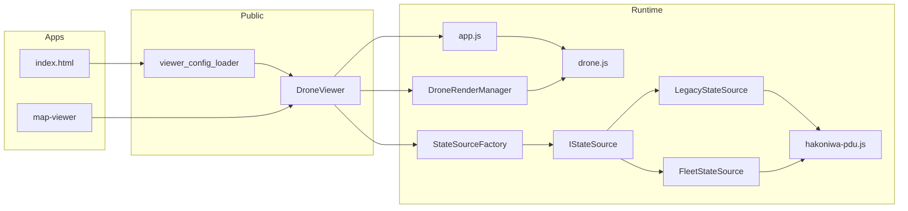
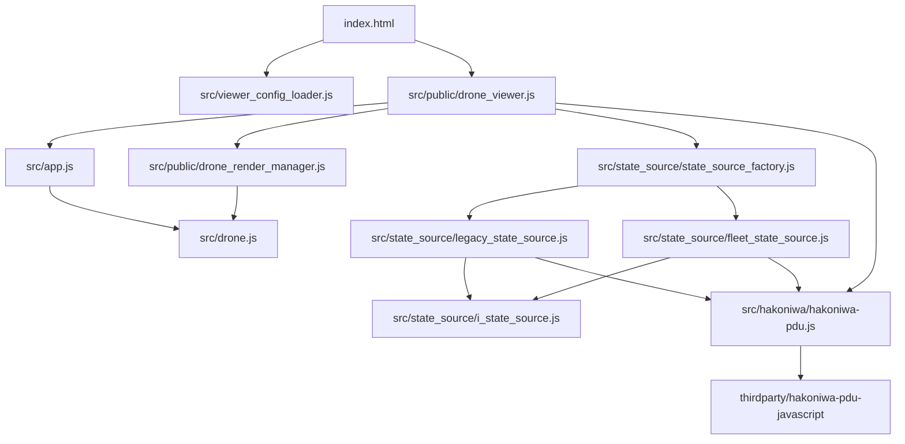

# hakoniwa-threejs-drone Design

## 1. 目的

1. threejs 単体で動作確認できる構成を維持する
2. 上位（index/map-viewer）は `DroneViewer` 公開 API のみ参照する
3. `legacy` / `fleets` の入力差分を `StateSource` へ閉じ込める
4. `drone.js` は描画責務に限定し、PDU I/O を持たない

## 2. 重要な設計決定（確定）

1. scene config は compact のみ受理する
2. scene config の `droneTypes` は外部ファイル化し、`droneTypesPath` で参照する
3. scene config の座標・姿勢はすべて ROS 座標系で記述する
4. `index.html` は `viewer_config` 駆動で起動する
5. `viewerConfigPath` は URL クエリで切替可能にする
6. `viewer_config` の相対パスは `viewer_config` ファイル基準で解決する
7. `stateInput.mode=fleets` では `wireVersion=v2` を必須にする
8. `pdudef` は compact 前提で扱う
9. `StateSource` は timer を持たず、`update()` は上位ループから呼ぶ
10. `StateSource` は `Drone` オブジェクトを保持せず、`getState(droneId)` で状態を返す

## 3. To-Be アーキテクチャ



## 4. JS依存関係（現状）



## 5. 公開 API 契約（DroneViewer）

```text
createDroneViewer(config?): DroneViewer
viewer.configure(config)
viewer.initialize({ droneConfigPath? })
viewer.connectPdu({ pduDefPath?, wsUri?, wireVersion? })
viewer.disconnectPdu()
viewer.initDronePdu()
viewer.getDrones()
viewer.getDroneStates(): DroneState[]
viewer.focusDroneById(id): boolean
viewer.setFollowSelectedEnabled(enabled): boolean
```

補足:
- `initialize()` 後に app 側 update フックへ同期処理を登録する
- `initDronePdu()` は全 droneId を `stateSource.bindDrone()` へ渡す責務

## 6. StateSource 契約（確定）

```text
interface IStateSource {
  initialize(params)
  bindDrone(droneId)
  update()
  getState(droneId) -> DroneState | null
  dispose()
}
```

責務境界:
- `StateSource` は PDU I/O と状態正規化を担当
- `DroneViewer` はオーケストレーション（呼び出し順/適用）を担当
- `Drone` は `applyState()` による描画反映のみ担当

## 7. モード別実装方針

### 7.1 LegacyStateSource

1. `roleMap.pos/motor` の pdutype から `org_name` を解決
2. compact `pdudef` 形状を検証
3. `update()` で各 droneId の pos/motor を読み込み
4. `getState(droneId)` で `DroneState` を返す

### 7.2 FleetStateSource

1. `roleMap.visual_state_array` の pdutype から入力チャネルを解決
2. `DroneVisualStateArray` をデコード
3. `start_index` / `valid_count` で chunk を再配置
4. `getState(droneId)` で `DroneState` を返す

## 8. app.js / drone.js の責務再定義

### 8.1 app.js

1. scene 初期化
2. render loop 実行
3. `beforeDronesUpdateHook` の呼び出しタイミング提供
4. viewer runtime options（小窓描画/メインカメラマウス）を反映

### 8.2 drone.js

1. 1機体の描画ノード管理
2. `applyState()` で受け取った値を描画へ適用
3. 入力未接続時のみデバッグ操作で更新

### 8.3 DroneRenderManager

1. `droneId` をキーに描画対象 `Drone` を索引化する
2. `StateSource` で正規化された `DroneState` を `upsert` で適用する
3. 現フレームで有効な描画対象集合を管理する（将来の動的増減拡張ポイント）

## 9. 設計完了基準

1. `StateSource` 契約が `legacy/fleets` で共通化されている
2. `drone.js` に PDU I/O 実装が存在しない
3. `viewer_config` だけで起動設定を切替できる
4. compact scene config / compact pdudef 前提が明記されている

## 10. `PduChannelConfig` との差分責務

`PduChannelConfig`（`thirdparty/hakoniwa-pdu-javascript`）と `StateSource` の責務は以下の通り分離する。

1. `PduChannelConfig` の責務
- pdudef のロードと正規化
- 通信層で必要なチャネルテーブル構築
- PDU read/write の基盤情報提供（`PduManager` 内部責務）

2. `StateSource` の責務
- `viewer_config.stateInput.roleMap` に基づく読み取り対象の選択
- mode 別のデータ解釈（legacy / fleets）
- 受信データを `DroneState` へ正規化
- `droneId` 単位で `getState()` へ提供

3. 境界ルール
- `StateSource` は `PduChannelConfig` の内部構造に依存しない
- `PduChannelConfig` は mode/roleMap を解釈しない
- 両者の接点は `PduManager` 経由の read API のみ
